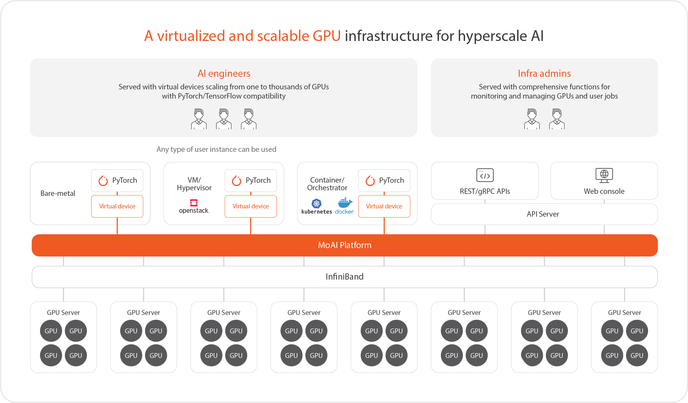
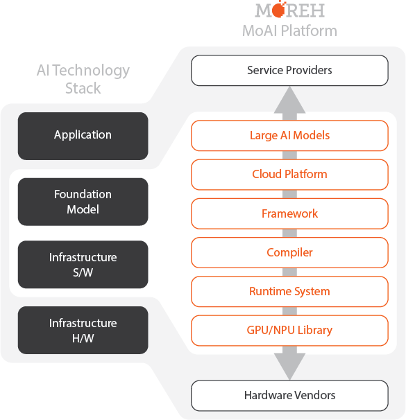
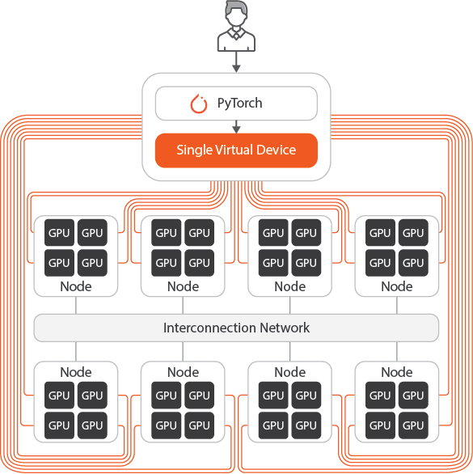
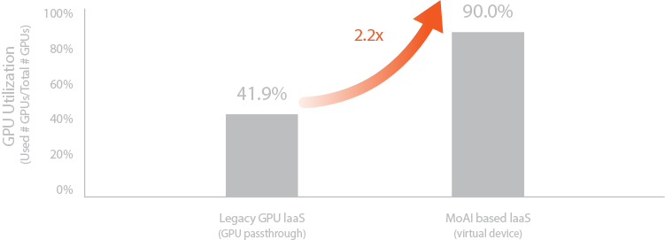
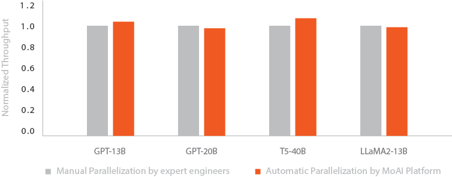

# MoAI Platform Overview

## MoAI Platform이란?

4차 산업혁명 시대에 접어들면서 AI 기술은 빠르게 발전하고 있습니다. 그럼에도 불구하고, 대규모 AI 모델을 개발하고 학습시키는 것은 여전히 많은 도전 과제를 안고 있습니다. 이러한 과제를 해결하기 위해 모레에서는 MoAI (Moreh AI Appliances for AI Accelerators) 플랫폼을 개발하였습니다.

MoAI 플랫폼은 수천 대의 GPU를 한번에 쉽게 제어할 수 있는 확장 가능한 AI 인프라를 제공합니다. 이를 통해 엔지니어들은 필요한 만큼의 GPU 자원을 할당받아 대규모 AI 모델을 훈련하고 서비스에 적용할 수 있습니다. 뿐만 아니라, 인프라 관리자들을 위한 직관적인 모니터링 및 관리 기능까지 갖추고 있어, 효율적인 운영이 가능합니다.

GPU 자원의 유연한 활용, 개발 및 관리의 편의성을 모두 갖춘 MoAI 플랫폼을 통해 AI 프로젝트의 성공에 한 걸음 더 가까워지게 될 것입니다.

## MoAI Platform 핵심 기술

딥러닝 모델이 진화함에 따라 파라미터가 수십억~수백억 단위로 확장되는 등 점점 복잡해지면서 AI 인프라에는 상당히 큰 규모의 컴퓨팅 리소스가 필요합니다. 대규모 모델을 개발시 수동 병렬 처리와 GPU 및 노드 관리를 동반하여 수많은 연산들을 최적화하는 과정이 필요하며 개발자들의 많은 노력과 시간이 많이 소요됩니다.

또한, 대규모 모델을 학습하고 추론하는 과정에서 GPU 노드 장애, 서버 온도 상승으로 인한 장애, 메모리 한계와 병목 현상 등등 이슈도 종종 발생하여 이를 해결하는 것은 매우 까다로운 작업입니다.

MoAI Platform의 GPU 가상화 기능과 자동 병렬화 기능은 앞서 언급한 한계와 어려움을 다음 기능으로 대응하여 대규모 AI 시대에 효율적인 인프라를 제공합니다.

1. **[다양한 가속기, 다중 GPU 지원](http://docs.moreh.io/about-moai/#1-다양한-가속기-다중-gpu-지원)**
2. **[GPU 가상화](http://docs.moreh.io/about-moai/#2-gpu-가상화)**
3. **[동적 GPU 할당](http://docs.moreh.io/about-moai/#3-동적-gpu-할당)**
4. **[AI Compiler 자동 병렬화](http://docs.moreh.io/about-moai/#4-ai-compiler-자동-병렬화)**

---

# MoAI Platform 특장점

## **1. 다양한 가속기, 다중 GPU 지원**

-

\
\
\
\
\
\
&nbsp;
&nbsp;

- MoAI 플랫폼은 다양한 AI 가속기를 지원하며, GPU의 종류에 관계없이 학습과 추론 작업을 실행할 수 있습니다.
    - LLM 대형 언어 모델(Llama2, GPT-3) 학습 및 추론
    - 생성형 AI 모델 학습 (LaMDA, PaLM, GPT, Text-to-Video 등)

사용자는 AMD, Intel 및 NVIDIA 외의 다른 AI 가속기와 함께 사용할 수 있으며, 이를 위해 딥러닝 개발 및 모델 학습을 위한 코드를 수정할 필요가 없습니다.\
\
\
\
\
\
\
\
&nbsp;
&nbsp;

------

## **2. GPU 가상화**

-

\
\
\
\
\
\
&nbsp;
&nbsp;

- MoAI 플랫폼의 가상화 기능은 수천 개의 GPU를 하나의 GPU처럼 작동할 수 있게 합니다.
- 모델링 및 최적화 프로세스를 간소화하여 AI 엔지니어에게 원활하고 효율적인 경험을 제공합니다.
    - 필요에 따라 GPU 자원을 확장하거나 축소할 수 있어 서비스의 확장성을 높일 수 있습니다.
    - 여러 GPU를 활용하는 복잡성을 추상화함으로써 딥러닝 작업에서 성능을 향상시키기 위한 리소스의 관리와 배포를 쉽게 할 수 있습니다.
- GPU 인프라 관리자는 가상화된 GPU를 효율적으로 활용함으로써 하드웨어의 비용을 절감할 수 있습니다.
\
\
\
\
\
\
&nbsp;
&nbsp;

------

## **3. 동적 GPU 할당**

- MoAI 플랫폼에서는 AI 엔지니어가 필요한 만큼의 GPU 자원으로만 딥러닝 학습 및 추론을 시작할 수 있습니다.
    - GPU 리소스는 연산 실행 중에만 할당되어 GPU 리소스를 효율적으로 활용할 수 있습니다. 이로 인해 소프트웨어 및 인프라 개발 비용을 줄이는 데 도움이 되며, 개발 및 배포 시간을 단축할 수 있습니다.
- MoAI Platform을 사용하면 동적 할당 시스템으로 인해 AI 엔지니어가 Port 연결 및 셋업하는 과정이 생략됩니다.
    - 일반적으로 딥러닝 개발자가 가상 GPU를 사용하기 위해서는 개발 환경 구축을 위해 PyTorch 또는 Tensorflow를 GPU 클러스터 기기의 백노드와 연결하여 각 프로세스가 다른 프로세스들과 데이터를 통신하도록 설정해야 합니다.
- 기존 방식의 GPU VM과 달리 GPU를 실제 사용하는 시간 동안만 분 단위 요금이 부과되는 완전한 종량제 방식으로 설계되어, 이용자의 사용 패턴에 맞추어 기존 대비 대규모의 비용 절감이 가능합니다.

## **4. AI Compiler 자동 병렬화**

- 인공지능 시대에는 대형 언어 모델(LLM) 및 대형 멀티모달 모델(LMM)과 같은 대규모 모델의 훈련 및 추론에 상당한 규모의 GPU 클러스터와 효과적인 GPU 병렬화가 필요합니다.
- 현재 NVIDIA와 함께 사용되는 일반적인 AI 프레임워크는 모델의 크기와 복잡성, 그리고 사용 가능한 GPU의 크기나 클러스터에 따라 AI 엔지니어가 병렬화를 수동으로 조정해야 합니다. 이 과정은 시간이 많이 소요되며 종종 몇 주가 걸립니다.
- MoAI 플랫폼은 특정 AI 모델과 GPU 클러스터의 크기를 기반으로 GPU 리소스를 최적으로 활용하는 Moreh AI 컴파일러를 통해 자동 병렬화를 제공합니다.
- 자동 병렬화를 통해 NVIDIA와 같이 몇 주가 걸리는 AI 모델의 설정 및 배포 시간을 2~3일로 대폭 단축할 수 있습니다.

Copyright © 2024 Moreh Corporation
