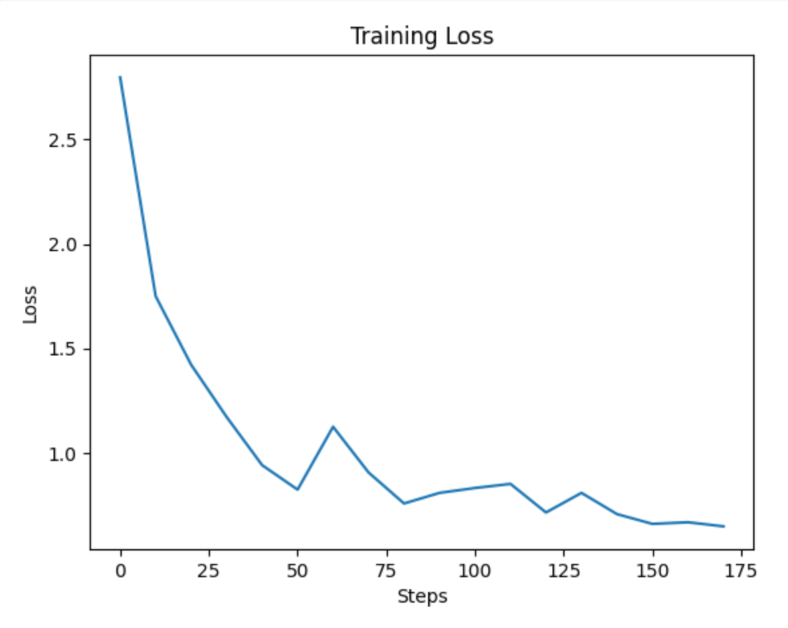

# 3. 학습 실행하기

이제 실제로 fine tuning을 실행해 보겠습니다.

# 가속기 Flavor 설정

MoAI Platform에서는 사용자에게 물리 GPU가 노출되지 않습니다. 대신 PyTorch에서 사용 가능한 가상의 MoAI Accelerator가 제공됩니다. 가속기의 flavor를 설정함으로써 실제로 PyTorch에서 물리 GPU를 얼마나 활용할지를 결정할 수 있습니다. 선택한 가속기 Flavor에 따라 학습 총 시간 및 gpu 사용 비용이 달라지므로 사용자의 학습 상황에 따른 판단이 필요합니다. 사용자의 학습 목표에 맞는 가속기 Flavor를 선택하기 위해 다음 문서를 참고하세요.

- ***[KT Hyperscale AI Computing (HAC) 서비스 가속기 모델 정보](/Supported_Documents/KT%20Hyperscale%20AI%20Computing%20(HAC)%20서비스%20가속기%20모델%20정보.md)***  문서를 참고하십시오.
- [LLM Fine-tuning 파라미터 가이드](/Supported_Documents/LLM_param_guide.md)

***(모든 문서에 추가될 그림 생성 예정)***

튜토리얼을 계속 진행하기 위해 인프라 제공자에게 각 flavor에 대응되는 GPU 종류 및 개수를 문의하십시오. 다음 중 하나에 해당하는 flavor를 선택하여 계속 진행하십시오.

- AMD MI250 GPU 16개 사용
    - Moreh의 체험판 컨테이너 사용 시: “4xlarge” 선택
    - KT Cloud의 Hyperscale AI Computing 사용 시: “4xLarge.2048GB” 선택
- AMD MI210 GPU 32개 사용
- AMD MI300X GPU 8개 사용

앞서 ‘[Baichuan2 Finetuning](index.md)’ 문서에서 MoAI Accelerator를 확인했던 것을 기억하시나요? 이제 본격적인 학습 실행을 위해 필요한 가속기를 설정해보겠습니다.

 먼저 `moreh-smi` 명령어를 이용해 현재 사용중인 MoAI Accelerator를 확인합니다.

```bash
$ moreh-smi
11:40:36 April 16, 2024
+-------------------------------------------------------------------------------------------------+
|                                                Current Version: 24.3.0  Latest Version: 24.3.0  |
+-------------------------------------------------------------------------------------------------+
|  Device  |        Name         |     Model    |  Memory Usage  |  Total Memory  |  Utilization  |
+=================================================================================================+
|  * 0     |   MoAI Accelerator  |  Large.256GB  |  -             |  -             |  -            |
+-------------------------------------------------------------------------------------------------+
```

현재 사용중인 MoAI Accelerator의 메모리 크기는 256GB입니다. 

`moreh-switch-model` 툴을 사용하여 현재 시스템에서 사용 가능한 가속기 flavor 리스트를 확인할 수 있습니다. 원활한 모델 학습을 위해 `moreh-switch-model` 명령어를 이용해 더 큰 메모리의 MoAI Accelerator로 변경할 수 있습니다. 

```bash
$ moreh-switch-model
Current MoAI Accelerator: Large.256GB

1. Small.64GB 
2. Medium.128GB 
3. Large.256GB  *
4. xLarge.512GB 
5. 1.5xLarge.768GB 
6. 2xLarge.1024GB 
7. 3xLarge.1536GB 
8. 4xLarge.2048GB 
9. 6xLarge.3072GB 
10. 8xLarge.4096GB 
11. 12xLarge.6144GB 
12. 24xLarge.12288GB 
13. 48xLarge.24576GB 
```

여기서 번호를 입력하여 다른 flavor로 전환할 수 있습니다. 

이번 튜토리얼에서는 2048GB 크기의 MoAI Accelerator를 이용하겠습니다.

따라서 처음 설정되어 있던 “Large.256GB” flavor를 “4xLarge.2048GB”로 전환한 다음 `moreh-smi` 명령을 사용하여 정상적으로 반영되었는지 확인하겠습니다. 

`2xLarge.1024GB` 사용을 위해 `8` 을 입력합니다.

```bash
Selection (1-13, q, Q): 8
The MoAI Accelerator flavor is successfully switched to  "4xLarge.2048GB".

1. Small.64GB 
2. Medium.128GB 
3. Large.256GB 
4. xLarge.512GB 
5. 1.5xLarge.768GB 
6. 2xLarge.1024GB 
7. 3xLarge.1536GB 
8. 4xLarge.2048GB *
9. 6xLarge.3072GB 
10. 8xLarge.4096GB 
11. 12xLarge.6144GB 
12. 24xLarge.12288GB 
13. 48xLarge.24576GB 

Selection (1-13, q, Q): q
```

`q` 를 입력해 변경을 완료합니다.

변경 사항이 잘 반영되었는지 확인하기 위해 다시 `moreh-smi` 명령어를 이용해 현재 사용중인 MoAI Accelerator를 확인합니다.

```bash
$ moreh-smi
+-----------------------------------------------------------------------------------------------------+
|                                                    Current Version: 24.3.0  Latest Version: 24.2.0  |
+-----------------------------------------------------------------------------------------------------+
|  Device  |        Name         |       Model      |  Memory Usage  |  Total Memory  |  Utilization  |
+=====================================================================================================+
|  * 0     |  KT AI Accelerator  |  4xLarge.2048  |  -             |  -             |  -            |
+-----------------------------------------------------------------------------------------------------+
```

`4xLarge.2048GB` 로 잘 변경된 것을 확인할 수 있습니다.

# 학습 실행

주어진 `train_baichuan2_13b.py` 스크립트를 실행합니다.

```
$ cd ~/quickstart
~/quickstart$ python tutorial/train_baichuan2_13b.py
```

학습이 정상적으로 진행된다면 다음과 같은 로그가 출력 될 것입니다. 로그를 통해 최적의 병렬화 설정을 찾는 Advanced Parallelism 기능이 정상 동작하는 것을 확인할 수 있습니다. 앞서 살펴 본 PyTorch 스크립트 상에서는 AP 코드 한 줄을 제외한 다른 부분에서 GPU 여러 개를 동시에 사용하기 위한 처리가 전혀 없었음을 참고하십시오.

```bash
2024-04-25 18:31:36,493 - torch.distributed.nn.jit.instantiator - INFO - Created a temporary directory at /tmp/tmph165oq0w
2024-04-25 18:31:36,494 - torch.distributed.nn.jit.instantiator - INFO - Writing /tmp/tmph165oq0w/_remote_module_non_scriptable.py
2024-04-25 18:31:54,239 - modeling_baichuan - WARNING - Xformers is not installed correctly. If you want to use memory_efficient_attention to accelerate training use the following command to install Xformers
pip install xformers.
The argument `trust_remote_code` is to be used with Auto classes. It has no effect here and is ignored.
The argument `trust_remote_code` is to be used with Auto classes. It has no effect here and is ignored.
^MLoading checkpoint shards:   0%|          | 0/3 [00:00<?, ?it/s]^MLoading checkpoint shards:  33%|███▎      | 1/3 [00:06<00:13,  6.88s/it]^MLoading checkpoint shards:  67%|██████▋   | 2/3 [00:13<00:06,  6.53s/it]^MLoading checkpoint shards: 100%|██████████| 3/3 [00:17<00:00,  5.40s/it]^MLoading checkpoint shards: 100%|██████████| 3/3 [00:17<00:00,  5.74s/it][2024-04-25 18:34:02.846] [info] Got DBs from backend for auto config.
[2024-04-25 18:34:04.427] [info] Requesting resources for KT AI Accelerator from the server...
[2024-04-25 18:34:04.438] [warning] A newer version of Moreh AI Framework is available. You can update the software to the latest version by running "update-moreh".
[2024-04-25 18:34:04.438] [info] Initializing the worker daemon for KT AI Accelerator
[2024-04-25 18:34:08.910] [info] [1/4] Connecting to resources on the server (192.168.110.7:24170)...
[2024-04-25 18:34:08.922] [info] [2/4] Connecting to resources on the server (192.168.110.42:24170)...
[2024-04-25 18:34:08.928] [info] [3/4] Connecting to resources on the server (192.168.110.72:24170)...
[2024-04-25 18:34:08.934] [info] [4/4] Connecting to resources on the server (192.168.110.93:24170)...
[2024-04-25 18:34:08.942] [info] Establishing links to the resources...
[2024-04-25 18:34:09.361] [info] KT AI Accelerator is ready to use.
[2024-04-25 18:34:09.627] [info] The number of candidates is 45.
[2024-04-25 18:34:09.627] [info] Parallel Graph Compile start...
[2024-04-25 18:34:21.670] [info] Elapsed Time to compile all candidates = 12043 [ms]
[2024-04-25 18:34:21.671] [info] Parallel Graph Compile finished.
[2024-04-25 18:34:21.671] [info] The number of possible candidates is 6.
[2024-04-25 18:34:21.671] [info] SelectBestGraphFromCandidates start...
[2024-04-25 18:34:23.154] [info] Elapsed Time to compute cost for survived candidates = 1483 [ms]
[2024-04-25 18:34:23.154] [info] SelectBestGraphFromCandidates finished.
[2024-04-25 18:34:23.154] [info] Configuration for parallelism is selected.
[2024-04-25 18:34:23.154] [info] No PP, No TP, recomputation : 1, distribute_param : true, distribute_low_prec_param : true
[2024-04-25 18:34:23.154] [info] train: true

2024-04-25 18:41:26.364 | INFO     | __main__:main:143 - [Step 1/104] Throughput : 590.2552103757937tokens/sec
2024-04-25 18:41:27.885 | INFO     | __main__:main:143 - [Step 2/104] Throughput : 190923.6976217358tokens/sec
2024-04-25 18:41:29.328 | INFO     | __main__:main:143 - [Step 3/104] Throughput : 189160.10152018082tokens/sec
2024-04-25 18:41:30.788 | INFO     | __main__:main:143 - [Step 4/104] Throughput : 196763.98302926356tokens/sec
2024-04-25 18:41:32.395 | INFO     | __main__:main:143 - [Step 5/104] Throughput : 178552.3508130907tokens/sec
2024-04-25 18:41:33.880 | INFO     | __main__:main:143 - [Step 6/104] Throughput : 196590.71636327292tokens/sec
2024-04-25 18:41:35.408 | INFO     | __main__:main:143 - [Step 7/104] Throughput : 190912.36004700614tokens/sec
2024-04-25 18:41:36.926 | INFO     | __main__:main:143 - [Step 8/104] Throughput : 191986.6925165269tokens/sec
2024-04-25 18:41:38.419 | INFO     | __main__:main:143 - [Step 9/104] Throughput : 195401.16844504434tokens/sec
```

Loss 값이 다음과 같이 떨어지며  정상 학습이 이루어지는 것을 확인할 수 있습니다.



학습 도중에 출력되는 throughput은 해당 PyTorch 스크립트를 통해 초당 몇 개의 token을 학습하고 있는지를 의미합니다.

- AMD MI250 GPU 8개 사용 시: 약 191605 tokens/sec

GPU 종류 및 개수에 따른 대략적인 학습 소요 시간은 다음과 같습니다.

- AMD MI250 GPU 8개 사용 시: 약 30분

# 학습 중에 가속기 상태 확인

학습 도중에 터미널을 하나 더 띄워서 컨테이너에 접속한 후 `moreh-smi` 명령을 실행하시면 다음과 같이 MoAI Accelerator의 메모리를 점유하며 학습 스크립트가 실행되는 것을 확인하실 수 있습니다. 실행 로그상에서 초기화 과정이 끝나고 Step 1~15가 출력되는 도중에 확인해 보시기 바랍니다.

```bash
$ moreh-2004-vm15  pytorch | ubuntu  ~  moreh-smi
+-----------------------------------------------------------------------------------------------------+
|                                                    Current Version: 24.3.0  Latest Version: 24.2.0  |
+-----------------------------------------------------------------------------------------------------+
|  Device  |        Name         |       Model      |  Memory Usage  |  Total Memory  |  Utilization  |
+=====================================================================================================+
|  * 0     |  KT AI Accelerator  |  4xLarge.2048GB  |  191605 MiB   |  2096640 MiB   |  100 %        |
+-----------------------------------------------------------------------------------------------------+
```